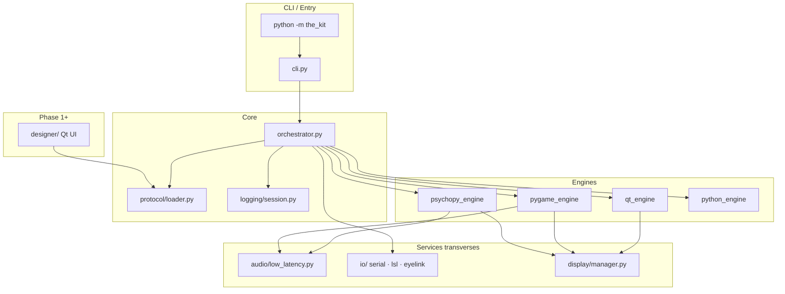
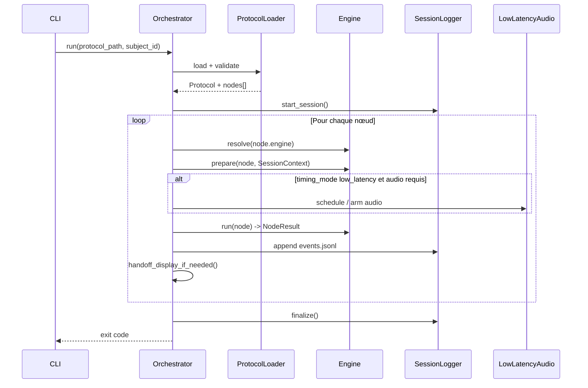
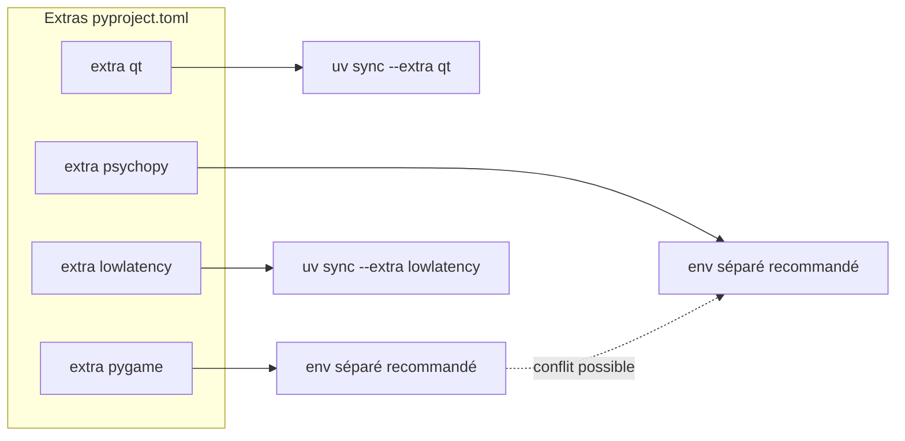

# ARCHITECTURE.md — The Kit

Document d’architecture technique.  
Spec produit : [PRD.md](./PRD.md) v1.5 · Contexte : [MEMORY.md](./MEMORY.md) · Agents IA : [CLAUDE.md](./CLAUDE.md)

**Statut implémentation** : **Phase 3 livrée** (`0.4.0a0`) — package `the_kit/` opérationnel (Qt, Pygame, PsychoPy, Python, LSL, scènes labo).

---

## 1. Objectifs architecturaux

| Objectif | Implication |
|----------|-------------|
| **Un protocole, plusieurs runtimes** | Un seul `protocol.json` ; exécution via Qt, Pygame, PsychoPy ou scripts Python |
| **Séparation affichage / audio critique** | `engine` (écran) ≠ `timing_mode` (PortAudio low-latency) |
| **Offline & reproductible** | Assets locaux, copie protocole en session, `environment.json` |
| **Extensibilité labo** | `python_task` (OpenSesame-like), registre `pygame_scene`, hooks P3 |
| **Portage, pas réécriture** | Modules dérivés d’Arôme, P1-P9, randomflow, etc. |

---

## 2. Vue système (C4 — niveau 1)

```text
┌─────────────────────────────────────────────────────────────────┐
│                        Utilisateurs                              │
│   Expérimentateur · Participant · Technicien labo · Développeur   │
└────────────┬───────────────────────────────┬────────────────────┘
             │                               │
             ▼                               ▼
┌────────────────────────┐      ┌───────────────────────────────┐
│   Mode Concepteur      │      │   Mode Participant (runtime)   │
│   (Qt — Phase 1+)      │      │   Orchestrateur + Engines      │
│   Éditeur · validate   │      │   Plein écran · collecte data  │
└───────────┬────────────┘      └───────────────┬───────────────┘
            │                                    │
            └────────────────┬───────────────────┘
                             ▼
              ┌──────────────────────────────┐
              │   Dossier protocole (data)    │
              │   protocol.json + assets/     │
              │   scripts/ · videos/ · audio/ │
              └──────────────────────────────┘
                             │
                             ▼
              ┌──────────────────────────────┐
              │   Dossier sessions/ (output)  │
              │   events.jsonl · CSV · logs     │
              └──────────────────────────────┘
```

---

## 3. Vue conteneurs (niveau 2)



| Composant | Responsabilité |
|-----------|----------------|
| **CLI** | `run`, `validate`, `check-engines`, `check-audio`, `dry-run` |
| **Orchestrateur** | Cycle de vie session, dispatch nœud → moteur, erreurs, abort |
| **protocol/** | Parse v1, migration Arôme v0, validation schéma |
| **engines/** | Implémentation `prepare` / `run` / `abort` par runtime |
| **audio/low_latency** | PortAudio via sounddevice (P1-P9) |
| **logging/session** | `events.jsonl`, CSV, `sync_trials.json` |
| **task_api** | `TaskContext`, `NodeResult` pour `python_task` |
| **designer/** | UI création protocole (hors runtime participant) |

---

## 4. Modèle d’exécution : protocole → session

### 4.1 Artefact protocole (entrée)

```text
my_protocol/
├── protocol.json           # graphe linéaire ou expansion conditions (P2)
├── scripts/                # python_task uniquement
├── videos/
├── audio/
└── images/
```

**Enveloppe JSON** (v1) :

| Section | Rôle |
|---------|------|
| `protocol_version` | Compatibilité schéma |
| `name`, `description` | Métadonnées |
| `display` | Plein écran, `screen_index` |
| `audio_defaults` | `timing_mode`, `blocksize`, `offset_ms`, … |
| `presentation` | Randomisation, seed (P2) |
| `conditions[]` | Design factoriel → essais (P2) |
| `nodes[]` | **Liste ordonnée** d’étapes exécutables |

### 4.2 Nœud — unité d’exécution

Chaque élément de `nodes[]` est un **nœud** :

```json
{
  "id": "unique_string",
  "type": "video",
  "engine": "qt",
  "timing_mode": "standard",
  "duration_s": 90,
  "file": "videos/stim.mp4"
}
```

| Champ | Obligatoire | Description |
|-------|-------------|-------------|
| `id` | recommandé | Clé logs / debug |
| `type` | oui | Sémantique stimulus (`video`, `python_task`, …) |
| `engine` | oui* | `qt` \| `pygame` \| `psychopy` \| `python` |
| `timing_mode` | non | `standard` \| `low_latency` (audio / sync) |
| `…` | selon type | Params spécifiques (`file`, `visual`, `script`, …) |

\* Défauts par type documentés PRD §4.3 ; import Arôme force `qt` + `standard`.

### 4.3 Session (sortie runtime)

À chaque `run`, création d’un répertoire session :

```text
sessions/20260522_S012_143022/
├── protocol.json
├── protocol.hash
├── environment.json
├── events.jsonl
├── responses.csv
├── sync_trials.json
└── logs/the_kit.log
```

---

## 5. Cycle de vie — orchestrateur



| Étape | Comportement |
|-------|--------------|
| **Load** | JSON Schema + fichiers assets + détection moteurs installés |
| **Prepare session** | Dossier session, `environment.json`, copie protocole |
| **Pour chaque nœud** | `prepare` → `run` → log ; gestion `on_error` (abort/skip) |
| **Handoff** | Fermeture/ouverture fenêtre entre moteurs ; `blank` optionnel |
| **Abort** | Touche expérimentateur → `abort()` sur moteur actif + flush logs |
| **Finalize** | Fermeture streams audio, résumé métriques |

---

## 6. Couche moteurs (engines)

### 6.1 Interface commune

```python
# the_kit/engines/base.py (cible)

class Engine(Protocol):
    name: str  # "qt" | "pygame" | "psychopy" | "python"

    def capabilities(self) -> list[str]: ...

    def prepare(self, node: Node, ctx: SessionContext) -> None: ...

    def run(self, node: Node, ctx: SessionContext) -> NodeResult: ...

    def abort(self) -> None: ...
```

```python
# the_kit/task_api.py (cible)

@dataclass
class NodeResult:
    status: Literal["ok", "error", "skip"]
    responses: dict | None = None
    rt_ms: float | None = None
    data: dict | None = None
    markers: list | None = None
```

### 6.2 Registre moteurs

```python
ENGINES = {
    "qt": QtEngine,
    "pygame": PygameEngine,
    "psychopy": PsychoPyEngine,
    "python": PythonEngine,
}
```

`EngineRegistry` vérifie au démarrage les imports optionnels (`check-engines`).

### 6.3 Moteur Qt (`qt_engine`)

| Responsabilité | Détail |
|----------------|--------|
| **Rôle** | Shell applicative, UI participant, médias « simples » |
| **Source** | Port `Projet_Arome_ANAELLE/psychophysique_app.py` |
| **Types nœuds** | `video`, `image`, `questionnaire`, `instructions`, `wait_key`, `slideshow` (P2) |
| **Stack** | PyQt6, `QMediaPlayer`, widgets |
| **Thread** | Thread UI principal ; pas de pygame dans le même process si conflit |

### 6.4 Moteur Pygame (`pygame_engine`)

| Responsabilité | Détail |
|----------------|--------|
| **Rôle** | Stimuli temps réel 60 FPS, scènes labo |
| **Source** | randomflow, shadowi, MOT, occultation |
| **Types nœuds** | `optic_flow`, `mot`, `shadow_ball`, `occultation`, `keyboard_response`, `pygame_scene`, `shapes` (partiel) |
| **Fenêtre** | Plein écran dédiée ; `SDL_VIDEO_WINDOW_POS` pour écran 2 |
| **Registre** | `pygame_handlers["optic_flow"]` → callable(node, ctx) |

### 6.5 Moteur PsychoPy (`psychopy_engine`)

| Responsabilité | Détail |
|----------------|--------|
| **Rôle** | Timing frame, gratings, vidéo MoviePy, photosonde |
| **Source** | P1-P9 `manip_psychophysique_json`, audi_visuel |
| **Types nœuds** | `av_sync` (affichage), `psychopy_stim`, `fixation`, `shapes`, `video` (frame-accurate) |
| **Contrainte** | Version figée ~2023.1.x ; venv séparé recommandé |
| **Fenêtre** | `visual.Window` par session ou réutilisée |

### 6.6 Moteur Python (`python_engine`)

| Responsabilité | Détail |
|----------------|--------|
| **Rôle** | Tâches custom type OpenSesame `inline_script` |
| **Chargement** | Import dynamique **uniquement** depuis `{protocol}/scripts/*.py` |
| **API** | `prepare(ctx)`, `run(ctx)` — `ctx: TaskContext` |
| **Pas d’affichage** | Peut appeler `ctx.get_engine("pygame")` pour dessiner (P2) |

---

## 7. Couche audio low-latency (transverse)

**Indépendante** des moteurs d’affichage. Activée par `timing_mode: "low_latency"`.

```text
Node (av_sync | audio)
        │
        ▼
┌───────────────────┐
│ LowLatencyPlayer  │  ← port ScheduledAudioPlayer (P1-P9)
│ sounddevice       │
│ OutputStream      │
│ callback + perf_counter
└─────────┬─────────┘
          ▼
   PortAudio Host API
   WASAPI | Core Audio | ALSA | …
```

| Paramètre | Source JSON |
|-----------|-------------|
| `audio_device_index` | Section `audio` nœud ou `audio_defaults` |
| `blocksize` | 64–128 typique |
| `output_sample_rate` | 44100 / 48000 |
| `offset_ms` | Décalage vs flip vidéo |
| `scheduling_lead_s` | Marge planification |

**Horloge** : `time.perf_counter()` partagée avec log `video_first_flip_perf`.

**Ne pas utiliser** : `QMediaPlayer` / `pygame.mixer` pour la piste critique en mode `low_latency`.

---

## 8. Présentation visuelle — cartographie architecture

Référence détaillée PRD §4.9. Résumé pour le routage moteur :

```text
                    type (nœud)
                         │
         ┌───────────────┼───────────────┐
         ▼               ▼               ▼
    fichier A        généré B         UI / overlay C
         │               │               │
    video, image    optic_flow,      questionnaire,
    slideshow,      shadow_ball,     instructions,
    av_sync         mot, shapes       fixation, blank
         │               │               │
         └─────── engine map ──────────┘
                 qt | pygame | psychopy
```

| Famille | Exemples `type` | Moteur par défaut |
|---------|-----------------|-------------------|
| **A — fichier** | `video`, `image`, `slideshow`, `av_sync` | qt / psychopy |
| **B — généré** | `shapes`, `optic_flow`, `mot`, `shadow_ball`, `occultation` | pygame / psychopy |
| **C — UI** | `instructions`, `questionnaire`, `fixation`, `blank` | qt |
| **E — code** | `python_task` | python |

---

## 9. I/O matériel (orchestrateur + ctx)

| Canal | Implémentation cible | Nœuds / API |
|-------|----------------------|-------------|
| **Série TTL** | `pyserial` | `trigger` (Arôme) ; `ctx.trigger.serial()` |
| **Clavier** | Hooks moteur / `ctx.wait_keys()` | `wait_key`, `keyboard_response` |
| **Arduino HID** | Touche simulée (ex. `t`) | Compatible `wait_key` |
| **LSL** | `pylsl` (P3) | Marqueurs essais |
| **EyeLink** | `pylink` (P3) | Messages trial via `python_task` ou module dédié |

---

## 10. Handoff entre moteurs

Problème : Qt, Pygame et PsychoPy possèdent chacun une fenêtre SDL/OpenGL/Qt distincte.

```text
Nœud N (pygame)          Nœud N+1 (qt)
     │                        │
     ▼                        ▼
 fermer pygame          ouvrir Qt widget
 Window                      │
     │                        │
     └──── blank (option) ────┘
           200–500 ms fond noir
```

| Règle | Détail |
|-------|--------|
| Ordre | Toujours **fermer** le moteur sortant avant d’ouvrir l’entrant |
| Focus clavier | Réattacher grab clavier au bon écran |
| Écran participant | `display.screen_index` lu une fois par session |
| Subprocess (P2) | PsychoPy isolé si conflit binaire avec pygame |

---

## 11. Modèle de données — événements

### 11.1 `events.jsonl` (journal canonique)

Une ligne JSON par événement (append-only) :

```json
{
  "ts_perf": 38192.445,
  "ts_iso": "2026-05-22T14:30:22.123456",
  "event": "video_first_flip",
  "node_id": "loom_trial",
  "node_type": "av_sync",
  "engine": "psychopy",
  "timing_mode": "low_latency",
  "payload": { "video_first_flip_perf": 38192.501 }
}
```

### 11.2 `responses.csv` (comportemental)

Une ligne par réponse questionnaire / clavier — colonnes normalisées PRD F-702.

### 11.3 `sync_trials.json` (métriques A/V)

Agrégat par essai : `audio_actual_start_perf`, `video_first_flip_perf`, `av_offset_measured_ms`, `audio_hostapi`.

---

## 12. Structure packages (cible)

```text
the_kit/
├── __init__.py                 # __version__
├── __main__.py
├── cli.py
├── orchestrator.py
├── task_api.py                 # TaskContext, NodeResult
│
├── protocol/
│   ├── __init__.py
│   ├── loader.py               # load, migrate_arome_v0
│   ├── models.py               # Node, Protocol, SessionConfig
│   └── validator.py              # JSON Schema
│
├── engines/
│   ├── __init__.py
│   ├── base.py
│   ├── registry.py
│   ├── qt_engine.py
│   ├── pygame_engine.py
│   ├── psychopy_engine.py
│   └── python_engine.py
│
├── audio/
│   ├── __init__.py
│   ├── low_latency.py          # ScheduledAudioPlayer port
│   └── device_select.py        # WASAPI / Core Audio / ALSA
│
├── display/
│   └── manager.py              # screen_index, handoff, refresh Hz
│
├── io/
│   ├── serial_trigger.py
│   └── lsl.py                  # P3
│
├── logging/
│   ├── session.py
│   └── events.py
│
└── designer/                   # Phase 1+
    └── ...

schemas/
├── protocol-v1.schema.json
└── nodes/
    ├── video.json
    └── python_task.json

examples/
└── demo_multi_engine/

tests/
├── test_protocol_loader.py
├── test_arome_import.py
└── test_python_task.py

requirements-qt.txt
requirements-pygame.txt
requirements-psychopy.txt
requirements-lowlatency.txt
```

---

## 13. Dépendances & déploiement ([uv](https://docs.astral.sh/uv/))

Gestionnaire : **uv** (`uv sync`, `uv run`). Environnement local : `.venv/` (créé par uv, non versionné).



| Profil | Commande | Usage |
|--------|----------|-------|
| **qt** | `uv sync --extra qt` | Phase 0, import Arôme |
| **+lowlatency** | `uv sync --extra lowlatency` | Sync A/V (Phase 1) |
| **+pygame** | `uv sync --extra pygame` | Flux optique, MOT |
| **+psychopy** | `uv sync --extra psychopy` | Manip psycho complète |

Fichiers `requirements-*.txt` : référence ; source de vérité = `pyproject.toml` + `uv.lock`.

---

## 14. Sécurité (architecture)

| Menace | Mitigation architecturale |
|--------|-------------------------|
| Code arbitraire via JSON | Pas d'`exec` string ; `python_task` = fichiers sous `scripts/` |
| Path traversal | Résolution chemins relative à `protocol_root` ; rejet `..` |
| Scripts malveillants | Confiance labo ; hash scripts dans `environment.json` |
| Perte données | `events.jsonl` append-only ; flush après chaque nœud |

---

## 15. Évolution par phase (alignement [ROADMAP.md](./ROADMAP.md))

| Phase | Composants livrés |
|-------|-------------------|
| **0** ✅ | orchestrateur Qt, protocol, logging, CLI |
| **1** ✅ | multi-moteur, low-latency, demo_multi_engine |
| **2** ✅ | `protocol/expander`, `importers`, `environment`, `export`, `designer/`, presets, nœuds Phase 2 |
| **3** | EyeLink, LSL, scènes pygame avancées |
| **3** | EyeLink, LSL, presets shadow/occultation, subprocess PsychoPy |

---

## 16. Références code externes (ports)

| Module The Kit | Origine |
|----------------|---------|
| `qt_engine` | `~/Documents/Projet_Arome_ANAELLE/psychophysique_app.py` |
| `audio/low_latency.py` | `P1-P9_remastered/.../manip_psychophysique_json/main.py` |
| `pygame_engine` / handlers | `randomflow`, `shadowi`, `MOT`, `occultation` |
| `psychopy_engine` | `audi_visuel`, manip JSON P1-P9 |

---

## 17. Diagramme de déploiement (poste labo)

```text
┌─────────────────────────────────────────────┐
│  PC labo (Windows / macOS / Linux)            │
│                                             │
│  ┌─────────────┐    ┌──────────────────┐  │
│  │ Écran 0     │    │ Écran 1          │  │
│  │ Expériment. │    │ Participant      │  │
│  │ (preview)   │    │ fullscreen       │  │
│  └─────────────┘    └──────────────────┘  │
│                                             │
│  python -m the_kit run …                    │
│  Casque USB (WASAPI / Core Audio)           │
│  Option : EyeLink · Cedrus · Arduino TTL    │
└─────────────────────────────────────────────┘
         │
         ▼
   sessions/ (local disk only)
```

---

## 18. Documents liés

| Document | Contenu |
|----------|---------|
| [PRD.md](./PRD.md) | Exigences fonctionnelles, critères MVP |
| [MEMORY.md](./MEMORY.md) | État projet, cheat sheet |
| [CLAUDE.md](./CLAUDE.md) | Instructions agents IA |

---

*Mettre à jour ce document lors de changements structurels (nouveau moteur, nouveau flux de données).*
