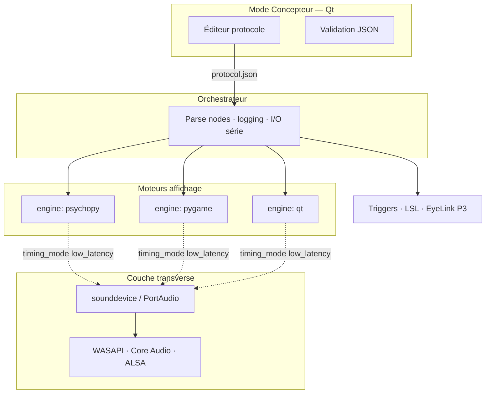

# MEMORY.md — The Kit

> **Rôle** : reprendre le fil en une lecture — vision, architecture, sources à porter, phase en cours, commandes futures.  
> **Ne remplace pas** le détail : [PRD.md](./PRD.md) · [ROADMAP.md](./ROADMAP.md) · [README.md](./README.md)  
> **Vault global labo** : `~/Documents/obsidian_vault/Travaux/MEMORY.md` · catégorie [[Categories/Neurosciences-Labo]] (chemin relatif vault)

---

## 1. En une phrase

**The Kit** = orchestrateur de manipulations psychophysiques : un **protocole JSON**, un **éditeur** (Qt), trois **moteurs d’affichage** (Qt, Pygame, PsychoPy) + une **couche audio low-latency** (PortAudio / WASAPI / Core Audio / ALSA) héritée de **P1-P9**.  
**Arôme** n’est que l’**exemple Qt de départ** — pas le nom du produit.

---

## 2. État du dépôt (2026-05-22)

| Élément | Statut |
|---------|--------|
| `PRD.md` | v1.5 — Phase 0 implémentée (voir §8) |
| `MEMORY.md` | ce fichier |
| `README.md` | démarrage rapide + liens docs |
| `doc_user.md` | guide utilisateur Phase 0 |
| `CLAUDE.md` | guide agents IA |
| `ARCHITECTURE.md` | aligné Phase 0 livrée |
| `ROADMAP.md` | M0 ✅ — Phase 1 en cours |
| Package `the_kit/` | **0.5.0a0** — + export BIDS, rapport HTML, Latin square, CI |
| `the_kit/io/` | `lsl.py`, `eyelink.py` |
| `the_kit/pygame_handlers/` | occultation, shadow_ball, mot |
| `the_kit/designer/` | concepteur Qt v1 |
| Tests | `pytest` — 23 tests |
| GitHub remote | à créer / lier si besoin |

**Prochaine action** : calibration oscilloscope ([doc_calibration.md](./doc_calibration.md)) ; tag `v1.0.0` MVP.

### Commandes (uv)

```bash
cd ~/Documents/TheKit/the_kit
uv sync --extra qt --extra pygame --extra lowlatency
uv pip install 'psychopy==2023.2.3' moviepy   # av_sync
uv run python -m the_kit check-engines
uv run python -m the_kit check-audio
uv pip install pylsl   # optionnel — LSL
uv run python -m the_kit check-lsl
uv run python -m the_kit run -p examples/demo_multi_engine/protocol.json -s DEMO
uv run python -m the_kit run -p examples/demo_phase3/protocol.json -s DEMO3
# Arôme complet (depuis dossier avec video/) :
# cd ~/Documents/Projet_Arome_ANAELLE/Projet_Arome_ANAELLE
# python -m the_kit run -p experiment9_notrig.json -s S001 --dry-run
```

---

## 3. Architecture — à retenir



### 3.0 Présentation visuelle (PRD §4.9)

| Famille | Nœuds | Exemples labo |
|---------|-------|----------------|
| **A — Fichiers** | `video`, `image`, `slideshow`, `av_sync` | Arôme, looming MP4 |
| **B — Généré** | `shapes`, `optic_flow`, `mot`, `shadow_ball`, `occultation`, … | randomflow, shadowi, MOT |
| **C — Overlay / UI** | `fixation`, `blank`, `photosonde_square`, `instructions`, `questionnaire` | croix, QCM |
| **D — Composite** | visuel + `keyboard_response` | classification B/M |

Détail : PRD **§5.2** (exigences **V-001…V-204**).

### 3.0b Tâches Python inline (OpenSesame)

Comme **inline_script** OpenSesame : nœud JSON **`python_task`** → fichier `scripts/ma_tache.py` avec `prepare(ctx)` / `run(ctx)`.

```json
{
  "type": "python_task",
  "engine": "python",
  "script": { "file": "scripts/hello.py", "run": "run", "prepare": "prepare", "args": {} }
}
```

- API : **`the_kit.task_api.TaskContext`** (`ctx.variables`, `ctx.log`, `ctx.trigger`, …)
- PRD **§4.10** · exigences **PY-001…PY-020**
- Pas de code Python dans le JSON (fichier uniquement)

### 3.1 Deux axes de configuration par nœud

| Champ | Valeurs | Rôle |
|-------|---------|------|
| **`engine`** | `qt` · `pygame` · `psychopy` · **`python`** | Affichage / UI ou **tâche `.py`** |
| **`timing_mode`** | `standard` · `low_latency` | Comment joue l’**audio critique** (et sync A/V) |

**Règle d’or** : `low_latency` ≠ PsychoPy obligatoire — audio via **callbacks PortAudio** (`ScheduledAudioPlayer` P1-P9), affichage peut rester psychopy ou pygame.

### 3.2 Horloge & sync (P1-P9)

- Référence : **`time.perf_counter()`**
- Audio : callback sounddevice, `outputBufferDacTime` si dispo
- Logs essai : `audio_actual_start_perf`, `video_first_flip_perf`, `audio_hostapi` (ex. `Windows WASAPI`)
- Cible labo indicative : jitter matériel A/V **&lt; 10 ms** (poste calibré ; voir `OPTIONS_JITTER_5MS.md` dans P1-P9)

---

## 4. Sources de code à porter (ne pas réinventer)

| Besoin | Dépôt local | Fichier / zone |
|--------|-------------|----------------|
| Qt vidéo + QCM + trigger + JSON | `~/Documents/Projet_Arome_ANAELLE` | `psychophysique_app.py`, `experiment*.json` |
| Low-latency audio + sync | `~/Documents/P1-P9_remastered/P1-P9_remastered` | `manip_psychophysique_json/main.py` (`ScheduledAudioPlayer`, `choose_device_os_aware`) |
| Doc anti-jitter / WASAPI | même repo | `ANTI_JITTER_METHODS.md`, `LINUX_AUDIO_OPTIONS.md`, `OPTIONS_JITTER_5MS.md` |
| Sync A/V standalone | `~/Documents/P1-P9_remastered/audi_visuel` | `main.py`, `main_psychopy.py` |
| Flux optique B/M | `~/Documents/noiseFlow/randomflow` | `optical_flow.py`, `config.json` |
| Oculométrie ombre | `~/Documents/shadowJB/shadowi` | `main.py` |
| Occultation / TTC | `~/Documents/occultation_Robin/occultation` | `main.py`, `occ_action_psychopy.py` |
| MOT | `~/Documents/MOT`, `MOT_Tunnel` | `MOT.py`, `scotoma.py` |
| TTL → touche T | `~/Documents/Arduino/triggerAnaelle` | sketch HID |

**Remote GitHub (ROSITO)** : `P1-P9`, `audi_visuel`, `randomflow`, `shadowi`, `ballfall` (occultation).

---

## 5. Protocole JSON — contrat minimal

### Enveloppe v1

```json
{
  "protocol_version": "1.0",
  "name": "...",
  "loop": 1,
  "audio_defaults": { "timing_mode": "low_latency", "blocksize": 128 },
  "nodes": []
}
```

### Nœuds Arôme v0 → mapping import

| Type Arôme | `engine` | `timing_mode` |
|------------|----------|---------------|
| `video` | `qt` | `standard` |
| `questionnaire` | `qt` | `standard` |
| `trigger` | orchestrateur | — |
| `wait_key` | `qt` | `standard` |

### Nœuds à fort enjeu timing

| Type | `engine` défaut | `timing_mode` défaut |
|------|-----------------|----------------------|
| `av_sync` | `psychopy` | **`low_latency`** |
| `audio` | `psychopy` | **`low_latency`** |
| `optic_flow` | `pygame` | `standard` |

---

## 6. Roadmap

**Détail complet** : [ROADMAP.md](./ROADMAP.md) (jalons M0–M4, livrables, checklists, releases).

| Phase | Livrable clé | Priorité |
|-------|--------------|----------|
| **0** | Orchestrateur + Engine Qt + import Arôme + CLI + logs | **✅** |
| **1** | Multi-moteur + low-latency + python_task | **✅** |
| **2** | conditions[], designer, export-zip, presets, consent/debrief | **✅** (`0.3.0a0`) |
| **3** | EyeLink, LSL, scènes labo | **en cours** |
| **3** | EyeLink, LSL, TR IRM, presets shadow/occultation | P3 |

### MVP (critères d’acceptation)

1. Démo **qt + pygame + psychopy** + un `av_sync` **`low_latency`**
2. Régression **Arôme** `experiment9.json`
3. Logs avec `audio_hostapi`, `*_perf`
4. `the_kit check-engines` + `the_kit check-audio`

---

## 7. Dépendances & environnements (uv)

| Profil | Commande uv | Contenu typique |
|--------|-------------|-----------------|
| Qt (Phase 0) | `uv sync --extra qt` | PyQt6, pyserial |
| + Pygame | `uv sync --extra pygame` | (Phase 1) |
| + PsychoPy | `uv sync --extra psychopy` | (Phase 1) |
| + Low-latency | `uv sync --extra lowlatency` | (Phase 1) |

Source de vérité : `pyproject.toml` + `uv.lock`. Fichiers `requirements-*.txt` = référence legacy.

**Conflits connus** : pygame ↔ psychopy → **2 environnements uv séparés** sur un même poste (modèle `audi_visuel`).  
**Windows audio** : viser **WASAPI** ; éviter Bluetooth pour essais sync ; doc casque filaire.

---

## 8. Structure code cible (à créer)

```text
the_kit/
├── __init__.py
├── __main__.py              # python -m the_kit
├── cli.py                   # run, check-engines, check-audio
├── orchestrator.py
├── protocol/
│   ├── loader.py            # v0 Arôme → v1
│   └── schema.py
├── engines/
│   ├── base.py              # prepare / run / abort
│   ├── qt_engine.py         # port Arôme
│   ├── pygame_engine.py
│   ├── psychopy_engine.py
│   └── python_engine.py     # python_task → scripts/*.py
├── task_api.py              # TaskContext, NodeResult (API scripts inline)
├── audio/
│   └── low_latency.py       # port ScheduledAudioPlayer P1-P9
├── logging/
│   └── session.py           # CSV + JSON, colonnes engine/timing_mode
└── designer/                # Phase 1+ — UI Qt éditeur
```

---

## 9. Cheat sheet — où agir

| Je veux… | Où aller |
|----------|----------|
| Comprendre le produit | [PRD.md](./PRD.md) §1–4 |
| Liste exigences (IDs F-/E-/LL-) | [PRD.md](./PRD.md) §5 |
| Reprendre après absence | **ce MEMORY.md** + dernière phase §6 |
| Tester une manip Arôme actuelle | `cd ~/Documents/Projet_Arome_ANAELLE && python psychophysique_app.py` |
| Référence sync WASAPI | `P1-P9_remastered/.../manip_psychophysique_json/main.py` |
| Lister devices PortAudio | `python -m sounddevice` (dans venv low-latency) |
| Inventaire tous outils labo | `obsidian_vault/Travaux/Categories/Neurosciences-Labo.md` |
| Contexte Maxime / autres projets | `obsidian_vault/Travaux/MEMORY.md` |

### Commandes futures (spec, pas encore implémentées)

```bash
cd ~/Documents/TheKit/the_kit
python -m the_kit run --protocol path/to/protocol.json --subject S001
python -m the_kit check-engines
python -m the_kit check-audio
```

---

## 10. Décisions figées (ne pas rouvrir sans raison)

| Décision | Pourquoi |
|----------|----------|
| The Kit ≠ fork Arôme | Arôme = subset Qt ; produit = orchestrateur multi-moteurs |
| 3 engines + timing_mode | Couvre déjà tout le labo documenté dans Travaux |
| Low-latency via PortAudio, pas seulement PsychoPy | Validé P1-P9 ; WASAPI sur Windows |
| Protocole JSON unique | Pattern labo existant (Arôme, randomflow, P1-P9) |
| Pas de cloud / pas de stats intégrées v1 | Export CSV/JSON seulement |
| NiDaq stimulation entrante hors scope | Distinct des triggers sortants |

---

## 11. Risques actifs

| Risque | Mitigation prévue |
|--------|-------------------|
| Conflits pip Qt/pygame/psychopy | Profils + 2 venv |
| Handoff fenêtre entre moteurs | Écran noir inter-nœud ; doc |
| Jitter &gt; 10 ms sur poste non calibré | `check-audio`, photosonde, logs `*_perf` |
| PortAudio capricieux macOS | Core Audio + tests ; venv dédié low-latency |
| Scope creep éditeur | Phase 0 = CLI + JSON ; éditeur Phase 1 |

---

## 12. Liens documentation

| Document | Chemin |
|----------|--------|
| PRD The Kit | `./PRD.md` |
| Guide IA | `./CLAUDE.md` |
| Architecture | `./ARCHITECTURE.md` |
| Fiche vault Arôme | `obsidian_vault/Travaux/Projets/Projet_Arome_ANAELLE.md` |
| Fiche P1-P9 | `obsidian_vault/Travaux/Repos/P1-P9_remastered.md` |
| Fiche audi_visuel | `obsidian_vault/Travaux/Repos/audi_visuel.md` |
| Index Travaux | `obsidian_vault/Travaux/00-Index.md` |

---

## 13. Journal de sessions (à compléter)

| Date | Fait | Suite |
|------|------|-------|
| 2026-09-15 | GVS : intensité NI par condition (`params.amplitudes`) | calibration oscillo / v1.0 |
| 2026-05-22 | PRD v1.5 : `python_task` + TaskContext (style OpenSesame) | Phase 1 |
| 2026-05-22 | PRD v1.4 : taxonomie visuelle §4.9 | — |
| 2026-05-22 | PRD v1.3 : relecture complétude (§5.11–5.17, events.jsonl, …) | — |
| 2026-05-22 | PRD v1.0→1.2 : multi-moteurs, low-latency WASAPI | MEMORY initial |
| | | |

---

*Mettre à jour ce fichier à chaque phase livrée ou décision d’architecture.*
