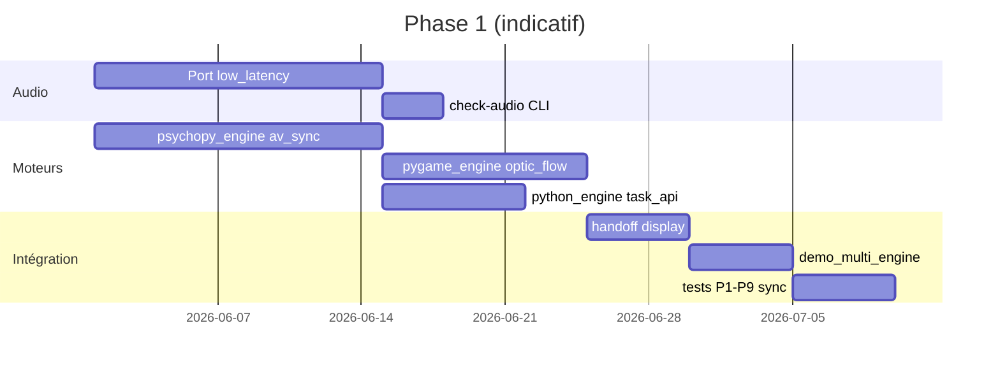

# ROADMAP.md — The Kit

Feuille de route produit et technique.  
**État au 2026-05-22** : **Phase 4 livrée** (`0.5.0a0`) — calibration oscilloscope / release v1.0.

Documents liés : [PRD.md](./PRD.md) · [ARCHITECTURE.md](./ARCHITECTURE.md) · [MEMORY.md](./MEMORY.md) · [CLAUDE.md](./CLAUDE.md) · [doc_user.md](./doc_user.md)

### Règle — mise à jour documentation (chaque phase)

À la **clôture** de chaque phase, mettre à jour **tous** les fichiers suivants (cohérence obligatoire) :

| Fichier | Contenu à actualiser |
|---------|----------------------|
| `ROADMAP.md` | Baseline §2, checklists §3.3+, matrice §8, suivi §15 |
| `MEMORY.md` | §2 état dépôt, §6 phase courante, commandes |
| `README.md` | Version, démarrage rapide, CLI disponibles |
| `PRD.md` | §8 statut phases, critères MVP si atteints |
| `ARCHITECTURE.md` | §15 composants livrés, structure packages réelle |
| `CLAUDE.md` | État repo, priorités dev, commandes |
| `doc_user.md` | Procédures utilisateur de la phase |

---

## 1. Vision par jalons

```text
2026 Q2          2026 Q3–Q4           2027+             
   │                 │                    │              
   ▼                 ▼                    ▼              
┌─────────┐    ┌─────────────┐    ┌──────────────────┐ 
│ M0      │    │ M1 — v1.0   │    │ M2 — Labo pro    │ 
│ Fondation│───▶│ Multi-moteur │───▶│ Design + presets │
│ Qt+Arôme │    │ A/V WASAPI   │    │ conditions[]     │
└─────────┘    └──────┬──────┘    └────────┬─────────┘  
                      │                     │          
                      └──────────┬──────────┘          
                                 ▼                     
                          ┌──────────────┐             
                          │ M3 — Avancé  │             
                          │ EyeLink·LSL  │             
                          │ scènes labo  │             
                          └──────────────┘             
```

| Jalon | Nom | Résultat pour l’utilisateur |
|-------|-----|----------------------------|
| **M0** | Fondation | Lancer une manip Arôme via `the_kit run` sans modifier le code source |
| **M1** | **v1.0 labo** | Une session = Qt + Pygame + PsychoPy + sync A/V WASAPI + scripts Python inline |
| **M2** | Labo enrichi | Protocoles factoriels, photosonde, templates, éditeur graphique utilisable |
| **M3** | Intégrations | EyeLink, LSL, occultation/shadow/MOT intégrés, IRM/TR en pont avec P1-P9 |
| **M4** | Maturité (optionnel) | i18n EN, BIDS export, subprocess isolé, polish UX |

Les dates sont **indicatives** — ajuster selon disponibilité CerCo / ROSITO.

---

## 2. État actuel (baseline)

| Domaine | Statut | Preuve |
|---------|--------|--------|
| PRD / architecture / mémoire | ✅ | Docs + chaîne alignée Phase 0 |
| Package `the_kit/` | ✅ **0.3.0a0** | |
| `conditions[]` + expansion | ✅ | `protocol/expander.py` |
| Concepteur v1 | ✅ | `the_kit design` |
| Export zip | ✅ | `the_kit export-zip` |
| Import P1-P9 | ✅ | `the_kit import-p19` |
| `environment.json` + hash médias | ✅ | `environment.py` |
| Presets | ✅ | `examples/presets/` |
| Release tag `v0.1.0-alpha` | ⚪ | À tagger sur git si souhaité |

---

## 3. Phase 0 — Fondation orchestrateur (M0) ✅

**Statut** : **livrée** le 2026-05-22 (`0.1.0a0`).

**Objectif** : prouver l’orchestration JSON + moteur Qt + traçabilité session, **sans régression Arôme**.

### 3.1 Livrables

| # | Livrable | Critère de done |
|---|----------|----------------|
| 0.1 | `pyproject.toml` / structure package | ✅ |
| 0.2 | `the_kit/protocol/` | ✅ |
| 0.3 | `the_kit/orchestrator.py` | ✅ |
| 0.4 | `the_kit/engines/qt_engine.py` | ✅ |
| 0.5 | `the_kit/logging/session.py` | ✅ |
| 0.6 | CLI | ✅ `run`, `validate`, `check-engines`, `migrate-preview` |
| 0.7 | `schemas/protocol-v1.schema.json` | ✅ |
| 0.8 | `examples/arome_import/` | ✅ `minimal_protocol.json` + README |
| 0.9 | Tests pytest | ✅ |
| 0.10 | `requirements-qt.txt` | ✅ |
| 0.11 | `doc_user.md` | ✅ |

### 3.2 Types de nœuds Phase 0

| Type | `engine` | Source |
|------|----------|--------|
| `video` | qt | Arôme |
| `questionnaire` | qt | Arôme |
| `trigger` | orchestrateur | Arôme |
| `wait_key` | qt | Arôme |
| `delay` | orchestrateur | nouveau (simple) |

### 3.3 Tests d’acceptation M0

- [x] `python -m the_kit run -p examples/arome_import/minimal_protocol.json -s TEST --dry-run`
- [x] CSV session + `events.jsonl` (réponses QCM sur protocole avec questionnaire)
- [x] `python -m the_kit validate` rejette types hors Phase 0
- [ ] Comparaison manuelle Arôme v0 vs The Kit sur `experiment9_notrig.json` (poste avec `video/`)
- [x] `check-engines` → `qt: ok` (si PyQt6 installé)

### 3.4 Hors scope Phase 0

- Pygame, PsychoPy, low-latency, éditeur, `python_task`, plein écran multi-écran avancé.

### 3.5 Dépendances

- Accès lecture `~/Documents/Projet_Arome_ANAELLE`
- Poste dev macOS ou Windows avec PyQt6

---

## 4. Phase 1 — v1.0 multi-moteur (M1) ✅

**Statut** : **livrée** le 2026-05-22 (`0.2.0a0`).

**Objectif** : session labo multi-runtime + audio low-latency + `python_task`.

### 4.1 Livrables

| # | Livrable | Critère de done |
|---|----------|----------------|
| 1.1 | `audio/low_latency.py` | ✅ |
| 1.2 | `audio/device_select.py` | ✅ |
| 1.3 | `engines/psychopy_engine.py` | ✅ `av_sync`, fixation, audio |
| 1.4 | `engines/pygame_engine.py` | ✅ |
| 1.5 | Handler `optic_flow` | ✅ port randomflow |
| 1.6 | `python_engine` + `task_api.py` | ✅ |
| 1.7 | `display/manager.py` | ✅ handoff |
| 1.8 | CLI `check-audio` | ✅ |
| 1.9 | `requirements-*.txt` | ✅ |
| 1.10 | `examples/demo_multi_engine/` | ✅ |
| 1.11 | Tests | ✅ 8 pytest ; sync P1-P9 terrain à faire |
| 1.12 | `doc_technician.md` | ✅ |

### 4.2 Types de nœuds Phase 1 (ajouts)

| Type | Moteur | Priorité |
|------|--------|----------|
| `av_sync` | psychopy + low_latency | P0 |
| `audio` | psychopy + low_latency | P1 |
| `keyboard_response` | pygame | P1 |
| `optic_flow` | pygame | P1 |
| `fixation` / `shapes` | psychopy ou pygame | P1 |
| `blank` | qt | P1 |
| `python_task` | python | P1 |
| `instructions` | qt | P1 |
| `image` | qt | P2 si temps |

### 4.3 Tests d’acceptation M1 (MVP v1.0)

- [x] Démo `demo_multi_engine` : qt + python + pygame (psychopy via pip manuel)
- [x] `check-audio` → Core Audio / WASAPI selon OS
- [x] `python_task` + variables dans `events.jsonl`
- [ ] `av_sync` low_latency validé sur poste avec médias P1-P9
- [ ] Jitter forward+WAV &lt; 10 ms sur poste référence documenté
- [ ] `check-audio` + `check-engines` OK sur poste labo référence
- [ ] 2 venv documentés si conflit pygame/psychopy

### 4.4 Jalons intermédiaires M1



---

## 5. Phase 2 — Labo multimodal & éditeur (M2) ✅

**Statut** : **livrée** le 2026-05-22 (`0.3.0a0`).

### 5.1 Livrables

| # | Livrable | Critère de done |
|---|----------|----------------|
| 2.1 | `conditions[]` + expansion | ✅ |
| 2.2 | `randomize_trials`, `random_seed`, ITI | ✅ |
| 2.3 | `photosonde_square` | ✅ (offset dans params + logs) |
| 2.4 | Presets | ✅ `examples/presets/` |
| 2.5 | `designer/` v1 | ✅ Qt minimal |
| 2.6 | Import P1-P9 | ✅ `import-p19` |
| 2.7 | Export zip | ✅ |
| 2.8 | `environment.json` | ✅ |
| 2.9 | `consent` / `debrief` | ✅ |
| 2.10 | `slideshow`, `block_break` | ✅ |
| 2.11 | `sync_trials.json` | ✅ (Phase 1) |
| 2.12 | Tests | ✅ 12 pytest |

### 5.2 Types de nœuds Phase 2 (ajouts)

| Type | Moteur | Note |
|------|--------|------|
| `slideshow` | qt | |
| `psychopy_stim` | psychopy | grating, text |
| `pygame_scene` | pygame | registre handlers |
| `block_break` | qt | |
| `consent`, `debrief` | qt | |

### 5.3 Tests d’acceptation M2

- [ ] Créer protocole « vidéo + QCM » en &lt; 15 min via éditeur (KPI)
- [ ] Import `manip_psychophysique_json` → run sans réécriture manuelle
- [ ] Photosonde : offset ms ajustable et loggé
- [ ] Export zip transférable sur 2ᵉ poste et reproductible

---

## 6. Phase 3 — Intégrations avancées (M3)

**Objectif** : parité fonctionnelle avec les manips spécialisées du vault Travaux.

**Durée indicative** : 8–12 semaines (parallélisable par brique).

### 6.1 Workstreams

| Stream | Livrables | Origine |
|--------|-----------|---------|
| **Oculométrie** | EyeLink connect, calib HV5, EDF, messages trial | shadowi, MOT |
| **Scènes pygame** | `shadow_ball`, `occultation`, `mot`, scotome | shadowi, occultation, MOT_Tunnel |
| **Psycho avancé** | `occultation_ttc`, `psychopy_routine` | occ_action_psychopy |
| **LSL** | Marqueurs stream | P1-P9_LSL |
| **IRM** | Pont TR (script séparé ou module P3) | P1-P9.py — pas dans orchestrateur v1 |
| **Robustesse** | Subprocess PsychoPy, embed pygame (option) | NF-08 |

### 6.2 Tests d’acceptation M3

- [x] Handlers `shadow_ball`, `occultation`, `mot` (pygame) + `occultation_ttc` (psychopy / subprocess)
- [x] LSL : section `lsl` protocole + `check-lsl` + marqueurs via `events.jsonl`
- [x] EyeLink : wrapper `io/eyelink.py` + script `examples/scripts/eyelink_calib.py` (dummy)
- [ ] Session shadow_ball sur poste EyeLink réel (hors CI)
- [ ] LSL vérifié dans LabRecorder (terrain)
- [ ] occultation cercle 0/1/2 validée vs repo occultation (terrain)
- [ ] **Calibration oscilloscope** — voir [doc_calibration.md](./doc_calibration.md)

---

## 7. Phase 4 — Maturité (M4) ✅ `0.5.0a0`

| Item | Statut |
|------|--------|
| Export BIDS | ✅ systématique en fin de `run` (`--no-export-session` pour off) |
| Rapport HTML session (F-1707) | ✅ `session_report.html` |
| Latin square (F-1105) | ✅ `presentation.counterbalance` |
| CI GitHub Actions | ✅ `.github/workflows/ci.yml` |
| Lanceur macOS | ✅ `scripts/run_the_kit.command` |
| i18n EN | ⬜ reporté |
| CPU affinity avancé | ⬜ doc P1-P9 |
| Installateur pyinstaller | ⬜ |

---

## 8. Matrice fonctionnalités × phase

Légende : ✅ livré · 🟡 en cours · ⬜ planifié · — hors scope v1

| Fonctionnalité | P0 | P1 | P2 | P3 |
|----------------|----|----|----|-----|
| Orchestrateur JSON | ✅ | ✅ | ✅ | ✅ |
| Engine Qt (Arôme) | ✅ | ✅ | ✅ | ✅ |
| Engine Pygame | — | ✅ | ✅ | ✅ |
| Engine PsychoPy | — | ✅ | ✅ | ✅ |
| Engine Python inline | — | ✅ | ✅ | ✅ |
| Low-latency WASAPI | — | ✅ | ✅ | ✅ |
| `video` / `questionnaire` / `trigger` | ✅ | ✅ | ✅ | ✅ |
| `av_sync` | — | ⬜ | ✅ | ✅ |
| `optic_flow` | — | ✅ | ✅ | ✅ |
| `shapes` / `fixation` | — | ✅ | ✅ | ✅ |
| `python_task` | — | ✅ | ✅ | ✅ |
| Éditeur graphique | — | — | ⬜ | ✅ |
| `conditions[]` / randomisation | — | — | ⬜ | ✅ |
| Photosonde / calibration | — | — | ⬜ | ✅ |
| Templates protocole | — | — | ⬜ | ✅ |
| shadow / occultation / MOT | — | — | — | ✅ |
| EyeLink | — | — | — | 🟡 (dummy + script calib) |
| LSL | — | — | — | ✅ |
| TR IRM intégré | — | — | — | — |
| Cloud / stats intégrées | — | — | — | — |

---

## 9. Releases proposées

| Version | Jalon | Contenu | Tag Git suggéré |
|---------|-------|---------|----------------|
| **0.1.0-alpha** | Fin M0 ✅ | Qt + Arôme + CLI + logs | `v0.1.0-alpha` / `0.1.0a0` |
| **0.2.0-alpha** | Mid M1 | + psychopy av_sync + low_latency | `v0.2.0-alpha` |
| **1.0.0** | Fin M1 | MVP complet multi-moteur | `v1.0.0` |
| **1.1.0** | Fin M2 | + éditeur + conditions + templates | `v1.1.0` |
| **1.2.0** | Fin M3 partiel | + EyeLink + 2 scènes labo | `v1.2.0` |

---

## 10. Documentation par phase

| Document | P0 | P1 | P2 | P3 |
|----------|----|----|----|-----|
| `README.md` | ✅ | MAJ | MAJ | MAJ |
| `doc_user.md` | ✅ Phase 0 | + WASAPI | + éditeur | + EyeLink |
| `doc_technician.md` | — | WASAPI | + photosonde | + LSL |
| `doc_dev.md` | — | engines | plugins | hooks |
| `CHOIX_MOTEUR.md` | — | ✅ | MAJ | MAJ |
| `examples/*` | arome | demo_multi | templates | shadow |

---

## 11. Dépendances entre phases

```text
Phase 0 (orchestrateur + Qt)
    │
    ├──▶ Phase 1a : low_latency (peut commencer en parallèle fin P0)
    │
    ├──▶ Phase 1b : psychopy_engine (dépend protocole + logs)
    │
    ├──▶ Phase 1c : pygame_engine (dépend handoff P1 ou minimal P0)
    │
    └──▶ Phase 1d : python_engine (dépend orchestrateur stable)
            │
            ▼
        Phase 1 intégration → v1.0.0
            │
            ▼
        Phase 2 (éditeur + conditions) — bénéficie de tous les types P1
            │
            ▼
        Phase 3 (streams parallèles EyeLink / scènes / LSL)
```

**Parallélisation possible en M1** : low_latency et python_engine peuvent avancer en parallèle une fois l’orchestrateur Phase 0 stable.

---

## 12. Risques roadmap & mitigations

| Risque | Impact | Mitigation | Phase |
|--------|--------|------------|-------|
| Conflits pip pygame/psychopy | Bloque M1 | 2 venv + doc ; subprocess P3 | M1 |
| Port Arôme plus lent que prévu | Retarde M0 | Port minimal d’abord ; tests auto | M0 |
| Jitter WASAPI non atteint | Bloque validation labo | Poste référence + doc technician | M1 |
| Scope éditeur trop large | Retarde M2 | MVP éditeur = liste + forms, pas drag perfection | M2 |
| EyeLink SDK / OS | Retarde M3 | Mode dummy ; module optionnel | M3 |
| Maintenance solo | Dette technique | Tests P0/P1 ; ARCHITECTURE à jour | Continu |

---

## 13. Objectifs produit (rappel PRD)

| ID | Objectif | Phase cible |
|----|----------|-------------|
| O1 | Protocole JSON unique | M0 |
| O3 | Régression Arôme | M0 |
| O2 | 3+ moteurs même session | M1 |
| O7 | Low-latency P1-P9 | M1 |
| O12 | `python_task` OpenSesame-like | M1 |
| O11 | Catalogue visuel éditeur | M2 |
| O8 | Reproductibilité hash/logs | M2 |

---

## 14. Prochaines actions immédiates

1. **Calibration oscilloscope** — [doc_calibration.md](./doc_calibration.md)
2. Validation terrain EyeLink + LabRecorder
3. **Release v1.0.0** — tag MVP multi-moteur

---

## 15. Suivi

| Date | Jalon | Note |
|------|-------|------|
| 2026-05-22 | Docs | PRD 1.5, ARCHITECTURE, CLAUDE, ROADMAP |
| 2026-05-22 | **M0 livré** | `0.1.0a0` |
| 2026-05-22 | **M1 livré** | `0.2.0a0` |
| 2026-05-22 | **M2 livré** | `0.3.0a0` conditions, designer, export |
| 2026-05-22 | **M3 livré** | `0.4.0a0` LSL, EyeLink dummy, shadow/occultation/MOT |
| 2026-05-22 | **M4 livré** | `0.5.0a0` BIDS export, HTML report, Latin square, CI |
| | v1.0.0 | |

*Mettre à jour la table §15 à chaque release ou fin de phase.*

---

*Cette roadmap est vivante — ajuster les durées après le premier sprint M0.*
